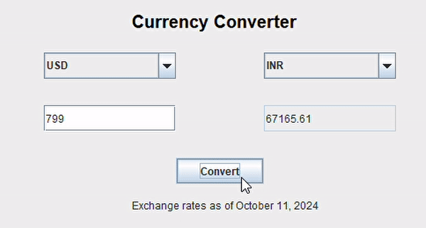

# Currency Converter Java Application

A simple currency converter application built in Java with a Graphical User Interface (GUI). The application converts values between 20 major currencies using the latest hardcoded exchange rates (as of October 11, 2024).

## Features
- **Clean, Intuitive GUI**: Allows users to easily select currencies, input amounts, and view conversions.
- **Up-to-date Exchange Rates**: Uses exchange rates from October 11, 2024.
- **Currency Options**: Supports conversion between 20 major global currencies.

## Demo


## Proof for you 🤗


## Technologies Used
- Java
- Swing (for GUI)

## Prerequisites

- Java 8 or above

## Installation

### Clone the Repository

```bash
git clone https://github.com/your-username/currency-converter.git
cd currency-converter
